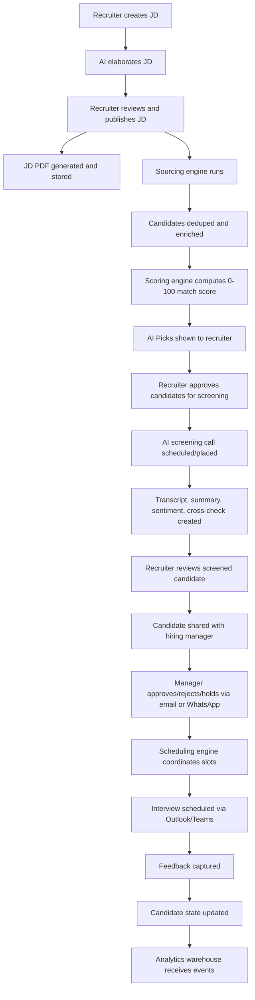

# Cosmo Films AI Recruitment Platform - Developer Markdown Version

**Source:** `Cosmo_Films_AI_Recruitment_PRD_v1.docx`  
**Document version:** v1.0, draft for internal review  
**Client:** Cosmo Films Limited  
**Prepared for:** engineering, design, QA, product, and implementation teams  
**Purpose of this markdown:** translate the PRD into a developer-executable build spec.

---

## 1. Product Thesis

Build an AI-powered recruitment platform for Cosmo Films that automates the hiring lifecycle from job description creation to candidate sourcing, AI match scoring, AI voice screening, recruiter review, hiring-manager handoff, interview scheduling, feedback capture, and analytics.

The platform does **not** replace recruiters or hiring managers. It removes repetitive sourcing, triage, calling, scheduling, and reporting work so humans can make faster and better hiring decisions.

---

## 2. Core Problem

Cosmo Films hires for niche manufacturing and business roles in specialty films such as BOPP, CPP, and BOPET. Mainstream job portals often return weak candidate density. Recruiters currently spend too much time on manual sourcing, first-level screening calls, candidate coordination, WhatsApp/email follow-ups, and status tracking.

The system must create a single source of truth for hiring activity and convert the hiring workflow into a measurable, auditable funnel.

---

## 3. Strategic Goals

| Goal | Meaning for Engineering |
|---|---|
| Reduce time-to-shortlist to under 5 working days | Build automation across sourcing, scoring, and screening. |
| Reduce recruiter effort by at least 60% in sourcing-to-screening | Minimize manual triage and repetitive calls. |
| Improve shortlist quality | Show explainable AI scores and screening signals. |
| Establish one hiring data system | Persist all candidate, JD, call, score, decision, and feedback events. |
| Scale across plants/functions | Design role-family, department, and location configuration cleanly. |

---

## 4. Phase 1 Success Metrics

| Metric | Target |
|---|---:|
| Time from JD published to first qualified profile surfaced | `< 24 hours` |
| AI screening call connection rate | `>= 70%` |
| Recruiter time per screened candidate | `< 4 minutes review` |
| AI-screened candidates progressing to interview | `>= 55%` |
| Candidate-side interview no-show rate | `< 15%` |
| Cost per qualified profile | Reduce 40% by month 6 |
| Candidate NPS after AI-screening call | `> 30` |

---

## 5. Main Personas

### 5.1 Recruiter

Primary daily user. Needs clear AI recommendations, candidate drill-down, Kanban workflow, search, filters, notes, override controls, and bulk actions.

### 5.2 Hiring Manager

Decision-maker who may not use the portal daily. Needs candidate summaries via email/WhatsApp, simple approve/reject/hold actions, slot selection, and structured feedback without forced login.

### 5.3 Candidate

Mobile-first end user. Needs respectful AI screening, transparent next steps, ability to reschedule, and clarity that the call is recorded/AI-assisted.

### 5.4 Talent Acquisition Lead

Owns hiring delivery. Needs pipeline visibility, source ROI, recruiter load, ageing reports, and executive dashboards.

### 5.5 IT / Infosec

Needs SSO, RBAC, audit logging, encryption, compliance, data residency, and vendor/sub-processor clarity.

---

## 6. Scope Summary

### 6.1 In Scope

- Recruiter web console.
- AI-assisted JD authoring.
- Cosmo-branded JD PDF generation.
- Candidate sourcing from LinkedIn, open web, and partner databases.
- Phase 2 Naukri integration.
- AI match scoring on a 0-100 scale.
- AI voice screening calls.
- Call transcript, recording, summary, sentiment, and resume-vs-call cross-check.
- Recruiter review dashboard with Kanban pipeline.
- Hiring manager handoff by email and/or WhatsApp.
- Interview scheduling through Outlook/Microsoft Teams and manager-asked slot collection.
- Post-interview feedback capture.
- Notifications through email, WhatsApp, SMS, and in-app messages.
- Analytics dashboards.
- RBAC, audit logs, DPDP-aligned consent capture, and TRAI-compliant outbound calling.

### 6.2 Out of Scope for Current Engagement

- Offer letter generation.
- Salary benchmarking automation.
- Background verification orchestration.
- Onboarding workflows.
- Internal mobility or performance management.
- Contract labour/vendor staffing portals.
- Candidate-facing self-service portal until Phase 3.
- Multilingual voice screening before Phase 3.

---

## 7. System Architecture - Developer View

Think of the platform as seven layers.

| Layer | Developer Meaning |
|---|---|
| Channel Layer | Telephony, inbound/outbound voice, email, WhatsApp, SMS. |
| Conversational AI Layer | STT, LLM orchestration, TTS, dialogue manager, voice persona. |
| Recruitment Workflow Layer | JD service, sourcing engine, scoring engine, screening orchestrator, scheduling engine, feedback service. |
| Integration Layer | LinkedIn partner connector, Naukri connector, partner DB connectors, Outlook/Teams, ATS/HRMS. |
| Data Layer | JD store, candidate store, conversation store, analytics warehouse, audit log. |
| Application Layer | Recruiter console, hiring manager email/WhatsApp interactions, executive dashboard. |
| Cross-Cutting Layer | Auth, SSO, RBAC, encryption, observability, audit, compliance. |

---

## 8. End-to-End Workflow



---

## 9. Phase Roadmap

| Phase | Timeline | Build Focus |
|---|---|---|
| Phase 1 - Core Loop | Weeks 1-10 after sign-off | JD authoring, LinkedIn + partner DB sourcing, scoring, AI calls, recruiter dashboard, manager handoff, Strategy B scheduling, notifications, baseline compliance and dashboards. |
| Phase 2 - Depth and Automation | Weeks 11-18 | Naukri, calendar-first scheduling, inbound email parsing, interview transcript ingest, HRMS join, executive dashboard, AI calibration proposals. |
| Phase 3 - Optimization and Self-Service | Weeks 19-28 | Predictive analytics, AI auto-ranking, candidate portal, multilingual screening, Indeed/Glassdoor if commercially permitted. |
| Pilot | 4 weeks before Phase 1 cutover | Two role families: one corporate, one plant. Exit criteria: connect rate above 60%, recruiter NPS above 25, no critical incidents. |

---

# 10. Module 1 - JD Creation

## 10.1 Purpose

Allow recruiters to create a structured, branded, AI-elaborated job description in under five minutes. The published JD becomes the canonical artifact for sourcing, scoring, screening, and downstream workflows.

## 10.2 Required JD Fields

| Field | Type | Developer Notes |
|---|---|---|
| Job Title | Free text | Required. Primary source for search keywords. |
| Department / Function | Dropdown | Sales, Operations, Supply Chain, Finance, HR, IT, R&D, Marketing, Legal, Plant Maintenance. |
| Sub-function | Dependent dropdown | Example: B2B Sales, Key Accounts, International Sales. |
| Locations | Multi-select | Managed list of Cosmo plant/office locations. |
| Job Type | Dropdown | Full-time, contract, intern. |
| Experience Range | Min/max numeric | Drives scoring hard filter. |
| CTC Band | Min/max numeric | Internal only unless explicitly exposed. |
| Reporting Manager | User picker | Used for interview routing. |
| Must-Have Skills | Tag input | Treated as hard skill matching signals. |
| Nice-to-Have Skills | Tag input | Treated as soft skill matching signals. |
| Preferred Industries | Tag input | Example: Specialty Films, Flexible Packaging, FMCG, Pharma Packaging. |
| Avoid Industries | Tag input | Optional negative filter. |
| Education | Multi-select | Required degree levels and preferred institutions. |
| Notice Period Acceptable | Dropdown | Immediate, 30, 60, 90 days. |
| Role Brief | Free text | Optional recruiter notes for AI elaboration. |

## 10.3 JD AI Output

The AI-generated JD must include:

- Company snapshot.
- Role purpose.
- 8-12 tailored responsibilities.
- Required qualifications.
- Preferred qualifications.
- What Cosmo offers.
- How to apply.

## 10.4 JD Acceptance Criteria

- Recruiter can publish a complete JD in under 5 minutes.
- Generated JD is professional and free of factual hallucinations.
- PDF matches Cosmo master template.
- Every published JD becomes discoverable by the sourcing engine within 60 seconds.

## 10.5 Developer Implementation Notes

Suggested entities:

```ts
type JobDescription = {
  id: string;
  requisitionId: string;
  title: string;
  department: string;
  subFunction?: string;
  locations: string[];
  jobType: 'full_time' | 'contract' | 'intern';
  experienceMin: number;
  experienceMax: number;
  ctcMinLakh?: number;
  ctcMaxLakh?: number;
  reportingManagerId: string;
  mustHaveSkills: string[];
  niceToHaveSkills: string[];
  preferredIndustries: string[];
  avoidIndustries: string[];
  educationRequirements: string[];
  acceptableNoticePeriod: 'immediate' | '30_days' | '60_days' | '90_days';
  roleBrief?: string;
  aiGeneratedBody?: string;
  publishedAt?: string;
  status: 'draft' | 'published' | 'archived';
};
```

---

# 11. Module 2 - Candidate Sourcing

## 11.1 Purpose

Build a high-recall, source-tagged candidate pool for each published JD.

## 11.2 Sourcing Sources

| Source | Phase | Notes |
|---|---|---|
| LinkedIn via approved partner | Phase 1 | No direct hiring API assumed. Use partner integration/authorized scraping. |
| Open web | Phase 1 | Search APIs and enrichment vendors. Contact data only from compliant vendors. |
| Partner candidate DBs | Phase 1 | At least two structured candidate databases. |
| Naukri.com | Phase 2 | API subject to partner contract. |
| Cosmo careers page | Phase 3 optional | Direct applicants. |

## 11.3 Source Tag Schema

```ts
type CandidateSource = {
  source: 'LinkedIn' | 'Internet' | 'Database-A' | 'Database-B' | 'Naukri' | 'Direct' | 'Referral';
  sourceUrl?: string;
  sourceConfidence: number; // 0-1
  capturedAt: string;
  openToWork: boolean | null;
  recentSignals: Array<{
    type: string;
    value: string;
    url?: string;
    capturedAt?: string;
  }>;
};
```

## 11.4 Deduplication Rule

Deduplicate candidates by:

```text
normalized_name + current_company + (phone OR email when available)
```

If candidate appears in multiple sources:

- Retain all source tags.
- Pick highest-confidence profile as canonical.
- Do not discard lineage.

## 11.5 Sourcing SLAs

| SLA | Target |
|---|---:|
| Default sourcing run per JD | Up to 200 candidates within 4 hours |
| Top candidates visible | Top 50 by score within 30 minutes |
| Refresh | On demand and every 24 hours for active JDs |

## 11.6 Developer Implementation Notes

Suggested entities:

```ts
type Candidate = {
  id: string;
  canonicalProfileId: string;
  name: string;
  email?: string;
  phone?: string;
  currentCompany?: string;
  currentDesignation?: string;
  totalExperienceYears?: number;
  education?: string[];
  currentLocation?: string;
  openToWork?: boolean | null;
  sources: CandidateSource[];
  resumeUrl?: string;
  createdAt: string;
  updatedAt: string;
};
```

---

# 12. Module 3 - Matching and Scoring Engine

## 12.1 Purpose

Score each sourced candidate against the JD on a 0-100 scale with explainability.

## 12.2 Default Scoring Rubric

| Feature | Weight | Computation |
|---|---:|---|
| Years of experience | 15% | Hard filter outside band; penalty within ±2 years; full score inside band. |
| Must-have skills | 25% | Semantic match against JD must-have tags. |
| Nice-to-have skills | 10% | Semantic match against nice-to-have tags. |
| Industry fit | 15% | Time-weighted overlap with preferred industries; negative for avoid-industries. |
| Company calibre | 10% | Configurable preference for product manufacturers, tier-1 brands, etc. |
| Education | 10% | Degree match; bonus for preferred institutions. |
| Tenure stability | 5% | Average tenure across last three jobs; penalty for frequent switching. |
| Location fit | 5% | Current location vs job location; relocation willingness. |
| Recent activity / engagement | 5% | Posts, certifications, conference activity. |

## 12.3 Candidate Tiers

| Tier | Score Range | UI Treatment |
|---|---:|---|
| Tier A - Recommended | `>= 80` | Gold border, AI Pick badge. |
| Tier B - Strong | `65-79` | Visible by default. |
| Tier C - Marginal | `50-64` | Behind Show All toggle. |
| Suppressed | `< 50` | Hidden by default, searchable. |

## 12.4 Explainability Requirements

Every score must show:

- Per-feature contribution.
- Evidence snippets.
- Matched JD bullet vs candidate evidence.
- Missing must-haves.
- Negative signals.
- Why candidate A ranked above candidate B.

A recruiter should understand the ranking in under 10 seconds.

## 12.5 Suggested Score Entity

```ts
type MatchScore = {
  id: string;
  candidateId: string;
  jobId: string;
  totalScore: number; // 0-100
  tier: 'recommended' | 'strong' | 'marginal' | 'suppressed';
  featureScores: Array<{
    feature: string;
    weight: number;
    rawScore: number;
    weightedScore: number;
    evidence: string[];
    missing?: string[];
    negativeSignals?: string[];
  }>;
  generatedAt: string;
  modelVersion: string;
};
```

## 12.6 Calibration Lifecycle

| Phase | Calibration Behavior |
|---|---|
| Weeks 1-4 | Recruiter supplies weights and hard filters. Accept/reject decisions are logged. |
| Weeks 5-12 | Nightly job proposes weight changes. Admin approves before applying. |
| Month 4+ | Model uses calibration data to auto-rank with less manual configuration. |

---

# 13. Module 4 - AI Screening Calls

## 13.1 Purpose

Run first-round telephonic screening with a natural AI voice agent. The call gathers qualification signals, answers role/company questions from an approved knowledge base, and produces recruiter-reviewable outputs.

## 13.2 Voice Persona

| Attribute | Requirement |
|---|---|
| Agent name | Default: Nikita from Cosmo Films. Configurable. |
| Language | Indian English only in Phase 1. No Hindi-English code mixing. |
| Tone | Warm, professional, businesslike. |
| Pace | Natural, with pauses, back-channeling, and barge-in support. |
| Identity transparency | If asked, agent says it is an AI assistant calling on behalf of Cosmo TA. Never claims to be human. |

## 13.3 Default Call Flow

1. Opening and identity confirmation.
2. Consent for 10-minute screening conversation.
3. One-sentence company/role snapshot.
4. Personalized opener if recent signal exists.
5. Current role and responsibilities.
6. Years of experience and education.
7. Notice period and employment status.
8. Current CTC.
9. Expected CTC.
10. Location and relocation willingness.
11. Motivation: why this role, why Cosmo, 2-3 year career view.
12. Candidate open Q&A.
13. Close with next-step timeline.

## 13.4 Conversational Rules

- Ask one question per turn.
- Do not combine CTC, relocation, notice period, or motivation into one question.
- Redirect out-of-scope questions.
- Never initiate discussion of caste, religion, marital status, family planning, pregnancy, or similar sensitive topics.
- Do not disclose compensation bands unless recruiter permits it for that role.
- Do not invent Cosmo facts.
- Internet search is off by default; if enabled, use an allow-list.

## 13.5 Call Lifecycle Edge Cases

| Case | Required Behavior |
|---|---|
| No answer | Up to 4 attempts over 7 days, 4-24 hours apart, avoid before 9am and after 8pm local time. |
| Final no-answer | Move candidate to `unreachable`; notify recruiter. |
| Abrupt disconnect | Call back within 60-120 seconds and resume from last completed question. |
| Candidate requests callback | Capture requested time and schedule next call; confirm by SMS/WhatsApp. |
| Inbound same number | Recognize number and resume context. |
| Inbound different number | Verify name and reference number; then resume. |
| Wrong number | Apologize, close, flag phone invalid. |
| Do not call / not interested | Mark not interested, capture reason if shared, suppress outreach for 90 days for that role family. |

## 13.6 Per-Call Outputs

The system must store:

- Audio recording.
- Verbatim transcript with speaker labels and timestamps.
- Structured Q&A summary.
- Executive summary, 3-5 sentences.
- Skills matched and skills missing.
- Resume-vs-call discrepancy report.
- Updated AI match score after call.
- Sentiment: positive, neutral, negative.
- Qualification tag: Qualified, Needs Recruiter Review, Not Qualified.
- Candidate questions for FAQ improvement.

## 13.7 Suggested Screening Session Entity

```ts
type ScreeningSession = {
  id: string;
  candidateId: string;
  jobId: string;
  applicationId?: string;
  status:
    | 'queued'
    | 'scheduled'
    | 'in_progress'
    | 'completed'
    | 'callback_requested'
    | 'no_answer'
    | 'unreachable'
    | 'wrong_number'
    | 'not_interested'
    | 'failed';
  attemptCount: number;
  maxAttempts: number;
  scheduledAt?: string;
  startedAt?: string;
  completedAt?: string;
  recordingUrl?: string;
  transcriptUrl?: string;
  transcriptText?: string;
  structuredSummary?: ScreeningStructuredSummary;
  executiveSummary?: string;
  sentiment?: 'positive' | 'neutral' | 'negative';
  qualificationTag?: 'qualified' | 'needs_recruiter_review' | 'not_qualified';
  resumeDiscrepancies?: ResumeDiscrepancy[];
  postCallScore?: number;
  consentCaptured: boolean;
  consentCapturedAt?: string;
  candidateQuestions?: string[];
  createdAt: string;
  updatedAt: string;
};

type ScreeningStructuredSummary = Array<{
  questionKey: string;
  questionText: string;
  answerText: string;
  confidence?: number;
}>;

type ResumeDiscrepancy = {
  field: string;
  resumeValue: string;
  callValue: string;
  severity: 'low' | 'medium' | 'high';
};
```

---

# 14. Module 5 - Recruiter Review Dashboard

## 14.1 Purpose

Give recruiters a single console to review AI-screened candidates, move them through the pipeline, and preserve a complete audit trail.

## 14.2 Pipeline Stages

```text
1. Sourced
2. AI Recommended
3. Approved for Screening
4. Screening Scheduled
5. Screened - Awaiting Review
6. Shared with Hiring Manager
7. Interview Scheduled - Round 1
8. Interview Scheduled - Round 2 / Senior Manager
9. Interview Scheduled - Round 3 / GM
10. Awaiting Feedback
11. Offer Stage
12. Rejected
13. On Hold
```

## 14.3 Candidate Card Must Show

- Name.
- Current company.
- Current role.
- Total experience.
- Current and expected CTC.
- Notice period.
- Location.
- AI match score and reasoning panel.
- Source tag and source link.
- Resume preview.
- AI screening summary.
- Sentiment and qualification tag.
- Audio recording player.
- Transcript download/view.
- Resume-vs-call discrepancy flags.
- Recruiter notes.
- Activity timeline.
- Emails/WhatsApp messages exchanged.

## 14.4 Recruiter Actions

- Drag/drop candidate across stages.
- Progress candidate using a button.
- Bulk approve for screening.
- Bulk reject with reason code.
- Reschedule screening call.
- Optional click-to-call.
- Share shortlist with hiring manager.

## 14.5 Audit Requirements

- Log every state change with user, timestamp, previous state, new state, and reason when applicable.
- Recruiter notes are immutable once saved; corrections are appended.
- Every access to a candidate record must be logged for DPDP audit.

## 14.6 Suggested Candidate Stage Entity

```ts
type CandidatePipelineEvent = {
  id: string;
  candidateId: string;
  jobId: string;
  previousStage?: CandidateStage;
  newStage: CandidateStage;
  reasonCode?: string;
  note?: string;
  actorUserId: string;
  createdAt: string;
};

type CandidateStage
  = | 'sourced'
    | 'ai_recommended'
    | 'approved_for_screening'
    | 'screening_scheduled'
    | 'screened_awaiting_review'
    | 'shared_with_hiring_manager'
    | 'interview_scheduled_round_1'
    | 'interview_scheduled_round_2'
    | 'interview_scheduled_round_3'
    | 'awaiting_feedback'
    | 'offer_stage'
    | 'rejected'
    | 'on_hold';
```

---

# 15. Module 6 - Hiring Manager Handoff

## 15.1 Purpose

Allow hiring managers to act through email or WhatsApp without forcing portal login.

## 15.2 Trigger

When recruiter moves a candidate to `Shared with Hiring Manager`, the system sends a structured shortlist email. Recruiter can batch multiple candidates.

## 15.3 Email Format

Subject:

```text
[Cosmo Hiring] N candidates ready for review - <Role Title>
```

Body includes:

- Role title.
- Location.
- Requisition ID.
- Recruiter context line.
- Candidate cards.

Each candidate card includes:

- Name.
- Headline.
- Experience.
- Current company.
- AI match score.
- Top 3 matched skills.
- 3-sentence AI screening summary.
- Link to full candidate page.
- Inline reply prompts:
  - Approve for Round 1.
  - Reject - reason.
  - Hold - call me.

## 15.4 Email Parsing Behavior

Inbound manager email is parsed into:

```ts
type HiringManagerDecision = {
  candidateId: string;
  jobId: string;
  managerId: string;
  decision: 'approve_round_1' | 'reject' | 'hold';
  reason?: string;
  question?: string;
  parserConfidence: number;
  confirmed: boolean;
  rawMessageId: string;
  createdAt: string;
};
```

If confidence is below threshold, send a confirmation email:

```text
We read this as: Approve A, Reject B - please confirm.
```

## 15.5 WhatsApp Alternative

If enabled, send candidate cards with quick replies:

- Approve.
- Reject.
- Hold.

WhatsApp requires Business API and manager opt-in.

---

# 16. Module 7 - Interview Scheduling

## 16.1 Purpose

Remove back-and-forth scheduling between candidate, recruiter, and manager.

## 16.2 Scheduling Strategies

### Strategy A - Calendar-First

Use when manager has connected Outlook calendar.

Flow:

1. Read manager free/busy.
2. Propose next available 30-minute windows at least 48 hours out.
3. Offer 3-4 slots to candidate.
4. Candidate selects slot.
5. Send Outlook calendar invite with Teams link.

### Strategy B - Manager-Asked

Default recommendation.

Flow:

1. Ask manager to share three slots over next five working days.
2. Manager replies naturally.
3. Parser extracts slots.
4. Candidate chooses slot.
5. System blocks manager calendar if connected.
6. Send Teams invite to both parties.

## 16.3 Multi-Round Support

Support three rounds:

1. Hiring Manager.
2. Senior Manager.
3. General Manager.

Round transitions require structured feedback from the previous round.

## 16.4 Reminder Cadence

| Recipient | Reminder Cadence |
|---|---|
| Candidate | T-24h, T-2h, T-15m via WhatsApp and email. |
| Manager | T-24h, T-30m via Outlook/Teams and WhatsApp/email. |

## 16.5 No-Show Rules

| Case | Behavior |
|---|---|
| Candidate no-show | Mark `no_show_round_1`; default 30-day cool-down. |
| Manager no-show | Notify recruiter and request a new slot from manager. |
| Reschedule request | Re-run slot matching. |

---

# 17. Module 8 - Interview and Post-Interview

## 17.1 During Interview

- Cosmo uses Microsoft Teams.
- Copilot may provide transcript and summary.
- If Copilot is unavailable, Fireflies.ai or equivalent may be invited.
- Transcripts/summaries must be ingested into the candidate record.

## 17.2 Interview Record Must Include

- Round number.
- Interviewer name.
- Date/time.
- Transcript when available.
- AI summary.
- Competencies discussed.
- Candidate strengths and gaps.
- Standout responses.
- Manager structured feedback.

## 17.3 Consent

- Candidate must be informed that interview is recorded/transcribed for hiring evaluation.
- Verbal consent captured.
- Candidate may opt out; if so, manager submits feedback manually.

---

# 18. Module 9 - Feedback Loop

## 18.1 Purpose

Capture structured, machine-readable feedback without forcing portal login.

## 18.2 Feedback Channels

1. Email reply to feedback request.
2. WhatsApp guided flow.
3. Passwordless web form as last resort.

## 18.3 Feedback Schema

| Field | Type | Requirement |
|---|---|---|
| Overall recommendation | Enum | Strong Hire, Hire, No Hire, Strong No Hire. |
| Technical competency | 1-5 | Required. |
| Domain / industry fit | 1-5 | Required. |
| Communication | 1-5 | Required. |
| Cultural fit / values alignment | 1-5 | Required. |
| Standout strengths | Free text | Optional but encouraged. |
| Concerns and gaps | Free text | Required if below Hire. |
| Next round recommendation | Enum | Proceed, Hold, Reject. |

## 18.4 Suggested Entity

```ts
type InterviewFeedback = {
  id: string;
  candidateId: string;
  jobId: string;
  interviewRoundId: string;
  managerId: string;
  overallRecommendation: 'strong_hire' | 'hire' | 'no_hire' | 'strong_no_hire';
  technicalCompetency: 1 | 2 | 3 | 4 | 5;
  domainFit: 1 | 2 | 3 | 4 | 5;
  communication: 1 | 2 | 3 | 4 | 5;
  cultureFit: 1 | 2 | 3 | 4 | 5;
  standoutStrengths?: string;
  concernsAndGaps?: string;
  nextRoundRecommendation: 'proceed' | 'hold' | 'reject';
  source: 'email' | 'whatsapp' | 'web_form';
  parserConfidence?: number;
  rawMessageId?: string;
  createdAt: string;
};
```

---

# 19. Module 10 - Notifications and Communications

## 19.1 Channels

- Email.
- WhatsApp Business API.
- SMS through DLT-registered templates.
- In-app notifications.

## 19.2 Communication Matrix

| Event | Candidate | Recruiter | Manager | Notes |
|---|---|---|---|---|
| Sourced and queued | - | In-app | - | Recruiter sees counts. |
| Screening call scheduled | SMS + WhatsApp | In-app | - | Candidate confirmation requested. |
| Screening call completed | - | Email + in-app | - | Summary attached. |
| Shortlist sent to manager | - | In-app | Email + WhatsApp | Reply-to enabled. |
| Interview scheduled | Email + WhatsApp | In-app | Calendar + WhatsApp | Teams link included. |
| Reminder | Email + WhatsApp | - | WhatsApp + Outlook | Cadence configurable. |
| Feedback requested | - | In-app | Email + WhatsApp | Within 30 minutes after interview. |
| Rejection | Email | In-app | - | Polite template, optional reason. |

---

# 20. Analytics Requirements

Analytics is a first-class module. Build event capture from day one.

## 20.1 Dashboards

| Dashboard | Users | Purpose |
|---|---|---|
| Recruiter Operational Dashboard | Recruiters | Daily worklist, pipeline, calls, AI outcomes. |
| Hiring Manager Snapshot | Managers | Weekly email summary. |
| TA Lead Pipeline Dashboard | TA Lead | Portfolio pipeline, source ROI, recruiter load, ageing. |
| CHRO Executive Dashboard | CHRO | Quarterly trends, cost per hire, quality of hire, AI ROI. |
| AI Performance Dashboard | Vendor + TA Lead | Calibration, overrides, drift. |
| Compliance Dashboard | Admin/Infosec | Consent, retention, access audit. |

## 20.2 Event Categories to Track

- JD lifecycle events.
- Sourcing events.
- Candidate scoring events.
- Recruiter review events.
- Screening call lifecycle events.
- Manager handoff events.
- Scheduling events.
- Interview events.
- Feedback events.
- Notification delivery events.
- Compliance/audit events.

## 20.3 Important Metrics

### Sourcing

- Profiles sourced.
- Source mix percentage.
- Match score distribution.
- Recommended tier yield.
- Time-to-first-qualified-profile.
- Cost per sourced profile.
- Cost per qualified profile.
- Source-to-hire conversion.
- Pool freshness.
- Duplicate rate.

### AI Screening

- Call attempts.
- Connect rate.
- Average call duration.
- Drop rate.
- Retry success rate.
- Inbound callback rate.
- Best-window heatmap.
- Qualification rate.
- Sentiment mix.
- Out-of-scope question rate.
- Resume-vs-call mismatch rate.
- Cost per screening call.

### Recruiter Productivity

- Profiles reviewed.
- Average review time.
- AI-recommend vs recruiter-approve agreement.
- Recruiter override pattern.
- Pipeline load.
- Stage ageing.
- Notes captured per candidate.

### Hiring Manager Engagement

- Shortlist response time.
- Shortlist approval ratio.
- Manager-side interview attendance.
- Feedback submission rate.
- Feedback quality score.
- Feedback turnaround.

### Funnel

- End-to-end TAT.
- Stage conversion rates.
- Drop-off heatmap.
- Offer acceptance rate.
- Time-to-fill.
- 90-day retention.
- Renege rate.

### AI Performance

- Top-K precision.
- Recall at threshold.
- Score-to-hire correlation.
- Recruiter override rate.
- Feature importance stability.
- Confidence distribution.
- Cross-check hit rate.
- A/B test lift.

### Candidate Experience

- Post-call NPS.
- Post-interview CSAT.
- Withdrawal rate.
- Complaints/escalations.
- Time-to-first-contact.
- Communication coverage.

### Compliance

- Consent capture rate.
- DND adherence.
- Data retention compliance.
- Access audit.
- Bias-sensitive field usage.

---

# 21. Required Integrations

## 21.1 Phase 1

| Integration | Purpose |
|---|---|
| Microsoft Entra ID | SSO for recruiters/admins. |
| Outlook / Microsoft 365 | Calendar read/write, email send-as Cosmo domain. |
| WhatsApp Business API | Candidate/manager communication. |
| SMS gateway | DLT-registered transactional templates. |
| Telephony provider | Outbound dialer with India DID numbers. |
| LinkedIn partner connector | Candidate sourcing. |
| Partner candidate databases | Candidate sourcing fallback. |

## 21.2 Phase 2

| Integration | Purpose |
|---|---|
| Naukri.com | JD posting and resume DB if commercially feasible. |
| Teams Copilot or Fireflies | Interview transcript ingest. |
| HRMS | Quality-of-hire and 90-day retention metrics. |

## 21.3 Phase 3 Optional

- Indeed.
- Glassdoor.
- DocuSign / digital signature provider.
- Background verification vendors.

---

# 22. Non-Functional Requirements

## 22.1 Performance

| Area | Requirement |
|---|---:|
| Recruiter console page load | P95 under 2 seconds on 10 Mbps. |
| AI screening response latency | Under 800 ms after candidate finishes speaking. |
| Sourcing search | First 50 results within 30 seconds for average JD. |
| Scoring 200 candidates | Under 60 seconds end-to-end. |

## 22.2 Availability

- Platform uptime: 99.5% monthly excluding scheduled maintenance.
- Telephony availability: 99.9% subject to vendor SLA.
- Maintenance windows: weekends 10pm-4am IST with 72-hour notice.

## 22.3 Scalability

- 100 active JDs.
- 50,000 active candidate records.
- Burst capacity: 1,000 outbound calls per hour without queueing.

## 22.4 Security

- TLS 1.2+ in transit.
- AES-256 at rest.
- Field-level encryption for phone and email.
- Secrets in managed vault.
- Quarterly third-party penetration test.
- SOC 2 Type II report available on request.

## 22.5 Reliability and Backup

- Database PITR for last 35 days.
- Daily logical backups retained for 90 days.
- Weekly backups retained for 12 months.
- DR RPO: 1 hour.
- DR RTO: 8 hours.

## 22.6 Observability

- Centralized structured logs with PII redaction.
- Distributed tracing across telephony, AI, and workflow services.
- SLO dashboards for connect rate, call quality, response latency, errors, queue depth.
- Pager alerts for consent capture failures, DND violations, and telephony SLA breaches.

## 22.7 Accessibility and Browser Support

- WCAG 2.1 AA recruiter console.
- Keyboard navigation across primary flows.
- Chrome, Edge, Firefox: last two stable versions.
- Tablet support for recruiter console.
- Mobile-responsive hiring manager and candidate confirmation views.

---

# 23. Compliance Requirements

## 23.1 DPDP

- Record lawful basis for candidate data processing.
- Process candidate data only for hiring purpose.
- Support candidate access/correction/erasure workflow with 30-day SLA.
- Capture call recording consent at start of AI screening.
- Publish DPO contact on candidate-facing notices.

## 23.2 TRAI / Calling

- Outbound calls only between 9am and 9pm local time.
- Check DND registry before outbound campaigns.
- Present Cosmo-branded caller line identification.

## 23.3 Data Retention

| Data | Retention |
|---|---|
| Active candidate records | Active engagement + 1 year unless erasure requested. |
| Call recordings | 12 months from call date, then purged. |
| Audit logs | 7 years. |
| Aggregated analytics | Indefinite if fully anonymized. |

## 23.4 Bias and Fairness

- Do not use age, gender, religion, caste, marital status, family details, or proxies in scoring.
- Quarterly bias audit where consented data exists.
- Human-in-the-loop required in Phase 1.
- No fully autonomous rejection decisions in Phase 1.

---

# 24. Suggested Engineering Epics

## Epic 1 - Auth, Tenancy, RBAC, Audit

Build:

- Microsoft Entra ID SSO.
- Roles: admin, recruiter, TA lead, hiring manager, viewer/support.
- Audit log service.
- Candidate record access logs.

Definition of done:

- User can log in.
- Permissions are enforced.
- Sensitive actions are auditable.

## Epic 2 - JD Creation and Publishing

Build:

- JD form.
- AI JD generation.
- Inline review/edit.
- Publish state.
- Branded PDF generation.
- Version history.

Definition of done:

- Recruiter can create, edit, publish, and version a JD.
- Published JD triggers sourcing workflow.

## Epic 3 - Candidate Sourcing and Deduplication

Build:

- Source connectors abstraction.
- Candidate ingest pipeline.
- Deduplication.
- Source lineage.
- Enrichment fields.

Definition of done:

- Candidates from multiple sources land in one canonical pool.
- Source lineage remains visible.

## Epic 4 - Scoring Engine

Build:

- Default scoring rubric.
- Weight configuration per JD.
- Feature-level score breakdown.
- Candidate tiering.
- Reasoning panel.

Definition of done:

- Recruiter can understand why candidate is recommended.

## Epic 5 - Screening Session Orchestrator

Build:

- Screening queue.
- Attempt lifecycle.
- Telephony integration.
- Callback scheduling.
- Consent capture.
- Status transitions.
- Recording/transcript storage.

Definition of done:

- Candidate can be queued, called, retried, completed, and reviewed.

## Epic 6 - AI Call Analysis

Build:

- Transcript ingestion.
- Structured Q&A extraction.
- Executive summary.
- Sentiment.
- Skills matched/missing.
- Resume-vs-call discrepancy detection.
- Updated post-call score.

Definition of done:

- Completed call creates recruiter-readable candidate intelligence.

## Epic 7 - Recruiter Dashboard

Build:

- Kanban pipeline.
- Candidate cards.
- Filters/search.
- Bulk actions.
- Notes.
- Timeline.
- Audio/transcript viewer.

Definition of done:

- Recruiter can run day-to-day screening review from one console.

## Epic 8 - Hiring Manager Handoff

Build:

- Shortlist email generation.
- Candidate card email template.
- Passwordless shortlist view.
- Email reply parser or WhatsApp fallback.
- Decision state updates.

Definition of done:

- Manager can approve/reject/hold without portal login.

## Epic 9 - Scheduling

Build:

- Manager-asked scheduling flow.
- Candidate slot selection.
- Outlook calendar invite generation.
- Teams link generation.
- Reminder system.
- Reschedule/no-show handling.

Definition of done:

- Approved candidate can be scheduled without manual back-and-forth.

## Epic 10 - Interview Feedback

Build:

- Feedback request triggers.
- Email/WhatsApp/web-form feedback capture.
- Structured feedback schema.
- Parser confidence and clarification loop.
- Candidate state update.

Definition of done:

- Feedback closes the interview loop and triggers next-step workflows.

## Epic 11 - Notifications

Build:

- Notification event bus.
- Email templates.
- WhatsApp templates.
- SMS templates.
- In-app notifications.
- Delivery logs.

Definition of done:

- Communication matrix events are covered and traceable.

## Epic 12 - Analytics

Build:

- Analytics events.
- Operational dashboards.
- TA lead dashboard.
- AI performance dashboard.
- Compliance dashboard.
- Export/BI readiness.

Definition of done:

- Core funnel and productivity metrics are queryable.

---

# 25. First Build Order Recommendation

For a developer joining this codebase, build the product from the center outward:

1. **Data model first:** JD, Candidate, Application, MatchScore, ScreeningSession, PipelineEvent.
2. **Recruiter core UI:** JD creation, candidate list, candidate detail, screening actions.
3. **Mock sourcing/scoring:** seed fake but realistic candidates and match scores.
4. **Mock AI screening:** simulate transcript, summary, scoring, sentiment, and discrepancy report.
5. **Real LLM scoring:** send JD + resume/profile + transcript to model for structured output.
6. **Manager handoff:** email template and shortlist card.
7. **Scheduling:** manager-asked flow before calendar-first flow.
8. **Analytics events:** capture state transitions while features are still being built.
9. **Integrations:** connect real telephony, WhatsApp, Outlook, source APIs after core state machine is stable.

---

# 26. Developer Questions You Must Be Able to Answer

## 26.1 Product-Level Questions

- What problem does the platform solve?
- Who are the primary users?
- What is the difference between recruiter, hiring manager, and candidate workflows?
- What is Phase 1 vs Phase 2 vs Phase 3?
- What is the core loop of the product?

## 26.2 Data-Level Questions

- What is a JD in this system?
- What is a candidate?
- What is an application?
- What is a screening session?
- What states can a candidate move through?
- What states can a screening session move through?
- What fields are required for scoring?
- What data must be stored for audit/compliance?

## 26.3 AI-Level Questions

- What context does the AI screening agent need?
- What is the AI allowed to say?
- What is it forbidden to ask?
- How is the AI score calculated?
- What does explainability mean in the scoring panel?
- What does resume-vs-call cross-check compare?
- When does human review become mandatory?

## 26.4 Integration-Level Questions

- Which integrations are Phase 1 mandatory?
- Which are Phase 2?
- What happens if Naukri is unavailable?
- What happens if inbound email parsing is unreliable?
- What happens if the manager does not use Outlook calendar properly?
- What is the fallback path for each external dependency?

## 26.5 Compliance-Level Questions

- When is candidate consent captured?
- What is the DND check?
- What data is encrypted?
- What data is retained and for how long?
- What candidate attributes cannot be used in scoring?
- What must be logged for audit?

---

# 27. Open Items From PRD

| # | Open Item | Owner | Target |
|---:|---|---|---|
| 1 | Share at least three sample JDs and PDF template | Cosmo - Ankit | Within 3 working days of sign-off |
| 2 | Confirm feasibility of inbound email parsing | Vendor - Manat | Within 5 working days |
| 3 | Share HR use-case inventory and current client list | Vendor - Manat | Within 5 working days |
| 4 | Share commercials and customization rate card | Vendor - Manat | Within 5 working days |
| 5 | Confirm Naukri partnership commercials | Cosmo - Ankit | Best effort; gates Phase 2 |
| 6 | Architecture and scenario flowchart | Vendor - Prio | Within 5 working days |
| 7 | Update demo with match score and resume-vs-call cross-check | Vendor - Prio | Within 7 working days |
| 8 | Nominate Cosmo business and IT POCs | Cosmo - Ankit | Within 3 working days |
| 9 | Confirm Cosmo-side DPO contact | Cosmo - Ankit | Before Phase 1 kickoff |

---

# 28. Glossary

| Term | Meaning |
|---|---|
| AI Pick | Candidate scoring high enough to be surfaced as a recommendation. |
| BOPP / CPP / BOPET | Specialty plastic films manufactured by Cosmo. |
| BSP | WhatsApp Business Solution Provider. |
| Cross-check | Comparison of resume data against call responses. |
| DPDP | Digital Personal Data Protection Act, 2023. |
| DLT | TRAI-linked SMS template and consent registration system. |
| HRMS | Human Resource Management System. |
| JD | Job Description. |
| Kanban | Pipeline board with candidate cards by stage. |
| NPS | Net Promoter Score. |
| PII | Personally Identifiable Information. |
| SSO | Single Sign-On. |
| STT | Speech-to-text. |
| TTS | Text-to-speech. |

---

# 29. Mental Model for the Developer

This is not just a dashboard. It is a **state machine around hiring**.

The important objects are:

```text
JobDescription -> SourcingRun -> Candidate -> Application -> MatchScore -> ScreeningSession -> RecruiterDecision -> ManagerDecision -> Interview -> Feedback -> AnalyticsEvent
```

The product becomes understandable once you track:

1. **Who is acting?** Recruiter, candidate, manager, AI agent, system job.
2. **What object is changing?** JD, candidate, application, screening session, interview, feedback.
3. **What state changed?** Sourced to AI Recommended, Approved for Screening to Screening Scheduled, etc.
4. **What evidence was produced?** Resume, score, transcript, summary, feedback, audit event.
5. **What happens next automatically?** Call, notification, shortlist, scheduling, dashboard update.

Build the state machine correctly and the UI becomes a view over it.
